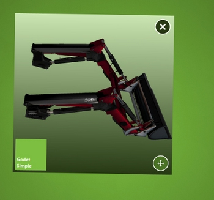

# 3D object

Use this content type  to displmay a 3D model of a product.

## Use in Compositeur Digital

With a 3D model you can:

- Press the central button to start looking around the model 

- Orbit around the model by moving a finger on the document
- Move and scale the view using two fingers
- Deactivate the view manipulation using the dedicated button on the bottom right (next to the document menu) 

## Content management

- Supported file extensions : `obj`, `3ds`, `lwo`, `stl`, `u3d`, `pdf`*

### Multiple file models

Som 3D file may require additionnal files for textures or other functionalities. In this case you can place the all files in a single folder with the same extension as the model file:

DIn this example you can see a `3ds` file along with its corresponding texture files in a folder named `Front Loader 3D.3ds`.

>#### *PDF 3D files
>3D models can be embedded in a PDF file. If you need to use such a PDF file in Compositeur Digital, place it in a folder with the extension `.u3d`. e.g. `Front Loader.u3d/model.pdf`.

### Displaying multiple parts of a model

You can choose to show or hide parts of a 3D model when displayed in Compositeur Digital. To do so, split the model in as much parts as desired, create a file for each part and place those files in the same folder.

For each model part a button will let you center the view on the part and a checkbox will let you toggle its visibility.

 

### Performance

3D render performance is linked to bothe the model complexity and your machine's performance. Try to keep your 3D models as simple as possible in terms of triangle count. To display a 360° view of a rendered model you should see section [360° objects](sequence.md). For a 360° view of a surrounding scene, see [3D panoramas](sequence.md).

[Back to supported types](content_types.md)
