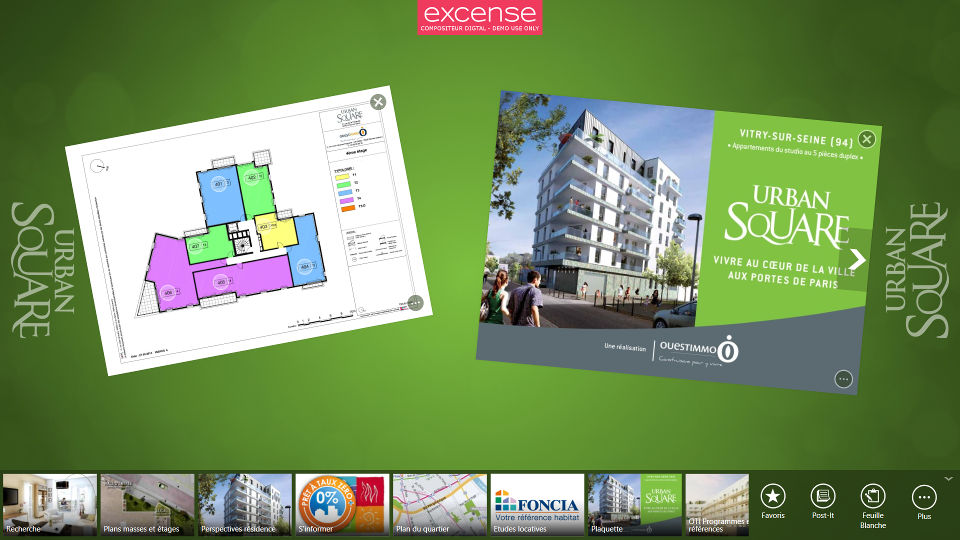
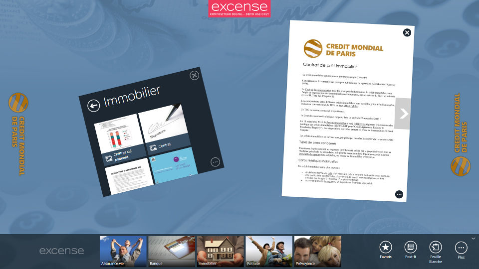
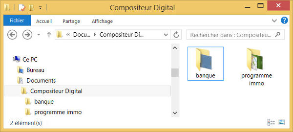
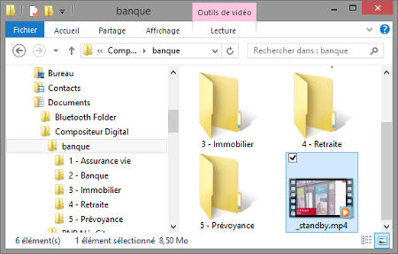

# Content management

Compositeur Digital uses a set of documents that you prepared in advance. Those documents are files on your computer that you can organize with folders for use in Compositeur Digital.

## Required skills

The preparation of a Compositeur Digital universe is done in Windows file explorer.

You should be confortable with:

- Navigate a files and folders hierarchy in Windows file explorer.
- Handle file operations : move, rename, delete, copy and paste.

### File extensions

Using Microsoft Windows, files are represented by a name an an *extension*, usually consisting of 3 or 4 letters after a point. The extension indicates the type of document stored in the file:

- Images : photo1.jpg, photo2.png
- Presentation : pres1.pptx, pres2.pdf
- Text file : table of content.txt

File explorer hides file extensions by default, we strongly recommend to change this setting:

## Universe

You can create multiple universes: group all documents relevant for your presentation (meeting, rsales pitch, etc.) in an universe:

Real estate

Banking services

Ech univers is a folder on your computer. Compositeur Digital will look fol univers folders in `Documents\Compositeur Digital` by default:

To create an univers, you can start from an existing univers by dublicating its folder, or simply create a folder in `Documents\Compositeur Digital`.

## Background

You might want to customize your univers by changing its background image. To do so, add an image file named `_background` directly in the universe folder:

## Folders

In an universe, you can organize your documents in folders and sub-folders.

The first level of folders will correspond to the sections avalaible int the menu bar in Compositeur Digital:

>###  Hidden folders
>
>Folders with extension '.content' will not be visible in Compositeur Digital. 
>See [interactive slideshow](slideshow#interactive) for a common use of this feature.

## Documents

Directly add documents in the folders and sub-folders of an univers.

See [Supported content](content_types.md) an exhaustive list of the supported file types.

## Display order

Compositeur Digital will display items in folders in alphabetical order. You can however force a specific order by prefixing file and folder names with a number, Compositeur Digital will not display the numbers but will arrange the displayed element in the specified order.

>If you need to display a file with a name starting with a number (e.g. `3D render`), see the [Advanced configuration](config#configuration_dun_document) section.

## Thumbnails 

Compositeur Digital will generate thumbnails for all documents. You can also customize the thumbnail for any document or folder for cases.

### Folder thumbnails

With no specified thumbnail for a folder, Compositeur Digital will use the thumbnail of the first item in ths folder:

 

Add an image file named `_preview` (png or jpg) directly in the folder:

 

### Document thumbnail

To customize the thumbnail for a document, place an image file with the same name suffixed with `_preview` in the same folder:

## Standby video

When in Kiosk mode Compositeur Digital can play a fullscreen video after a period of inactivity. The video will then loop until the screen is touched.

Place a supported video file named `_standby` in the universe folder:

 

All [supported video types](video.md) are suitable for use as a standby video.
