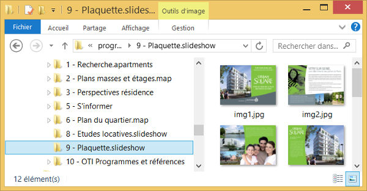
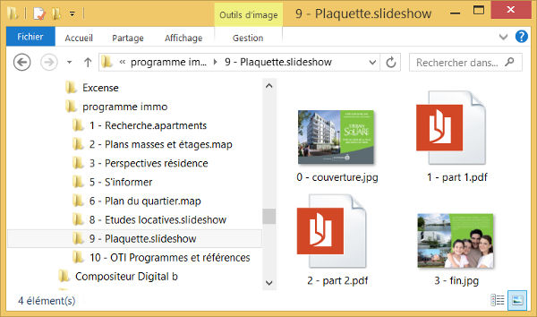
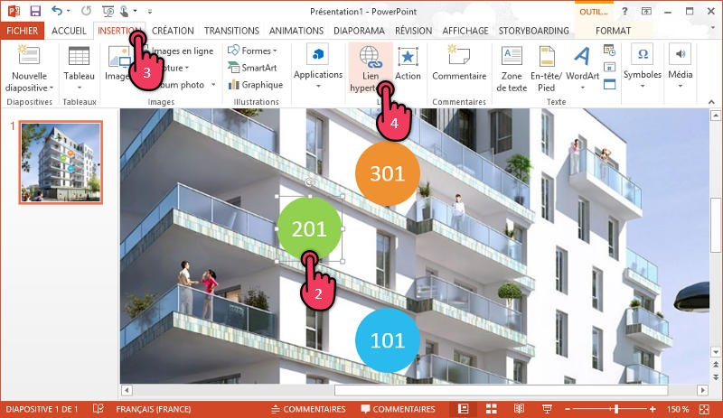

# Slideshow

Use this type of content to display a slideshow of images, or a presentation in PDF or Powerpoint.

## Use in Compositeur Digital

With a slideshow you can :

- Navigate to the previous and next slide with the `<` and `>` arrows
- Navigate to a specific slide with the `Slides` action in the document menu
- Open attached content
- Annotate
- Print

## Content management

A slideshow is created from a single PDF or Powerpoint file, or from a set of images or a combination of those documents.

### Powerpoint & PDF documents

- Supported extensions : `ppt`, `pptx`, `pdf`

>*Note 1:* som complex documents may no display properly. You may change the document format (e.g. save a Powerpoint presentation as a PDF) to try and circumvent the problem.

>*Note 2:* Compositeur Digital will not play transition effects and animations: each slide is a fixed image. You can however add touch "buttons" to open other documents (see [Interactivity](interactive)).

### Image set folder

- Folder extension : `slideshow`, `ppt`, `pptx`, `pdf`
- Supported extensions in the folder : `jpg`, `png`

Sample slideshow file hierarchy:

### Document set folder

You can create a single slideshw with a combination of Powerpoint, PDF and image files. Place all files the same folder with the extension `slideshow`.

Sample slideshow file hierarchy:

In this case, the resulting slideshow will display slides in this order: the fisrt image, the slides from the 2 PDF files and then the last image.

###  Interactivity

You can create a touch area on a slide of a Powerpoint presentation to opend content in Compositeur Digital.

1. Open your presentation with Microsoft PowerPoint.
2. Select the image or object you want to link to. It is recommended to choose an item that prompts the user to touch it to trigger the opening of the content.
	Warning: the operation will not work if you select the text contained in a form, it is the form itself that must be selected.
3. Go to the `INSERTION` tab of PowerPoint.
4. Click the 'Hyperlink' button in the corresponding menu.
5. In the window that appears, browse your files to choose the content that the link will open.
	Warning: you must choose content that is present somewhere in your universe.
	You can use [hidden folders] (manage_contents # contentFolder) (a `content` folder extension) if they only need to appear in the interactive slide show.
	
6. Click 'Open', then save your PowerPoint presentation.

[Back to supported content](content_types.md)
