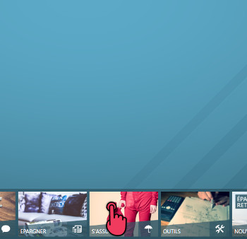
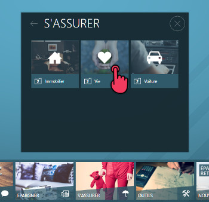
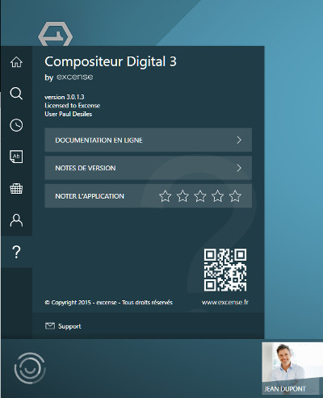

# Features overview

## Overview

The user interface contains three main areas:

1. A collaborative area to display and interact with the content.
2. A dock to browse and access your content. 
3. The main menu button  

## Opening a document

1. On the dock, tap on the section of your choice;
2. In the folder view, tap on document to display

## Manipulating a document

Use the following gestures:

Move 

Resize 

Rotate 

To close a document, tap the top right cross:

 Additionnal actions (annotate, print, share, *etc.*) are available in the `document action menu` available at the bottom right of any content:

## Creating projects

All your interactions with the content of an environnement are automaticaly saved (opened documents, annotations, user data). You can then assign a name your current projet to access it later.

1. Open the main menu.
2. The name of the current project is displayed at the top of the panel. Tap on the name to assign a new name. 

3. The `Open` and `New` buttons allows you to load a previously saved project or create a new project in the current environment.
4. The `Quit` button will close the current environment to take you to the home page.

## Search feature

1. In the main menu, type in your keywords in the designated area.
2. Documents with file names matching your criteria will appear as you type. Tap on the selected document to open it.

## Recent and frequetly used documents

This tab gives you quick access to all the documents that wwere opened. You can either sort them by most recent use with the `Recent` filter, or by total uses by tapping the `Most frequently used` filter.

## Notes and blank sheets

This tab lets you find all sticky notes and blank sheets that were created.

## Basket

Your basket is where you can store documents of interest. 
The `share` button will the let you share all the documents in the basket at the same time on a usb key, or by e-mail.

To add a document to the basket, tap the `Add to basket` button in the document menu.

To remove a document from your basket, tap the `Remove from basket` button in the same menu, or tap the close button on the top right of the document icon in the basket menu tab.

## Profile

The Profile tab is where you can find data relating to your interlocutor. Once entered here it will be used accordingly in relevant activities in the current project. e.g. when you fill out the `e-mail` field, it will be used as the recipient address when sharing a document by e-mail, and the `budget` information will be used by the [mortgage simulator](bank_simulator.md).

## Information

This last tab gives out general information on the software.
You will also find there a link to this documentation, and a way of sharing with us your impressions about Compositeur Digital with a rating.
Tap the `Support` button to send a mail to the excense tech support should you encounter a problem while using the software.

You can now move to [Content management](manage_contents.md).
